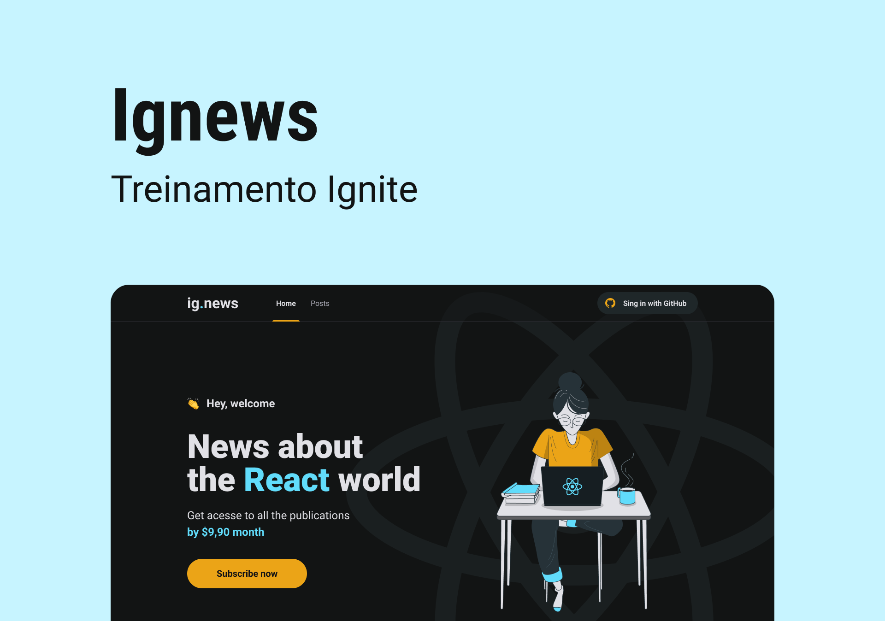

  

  <a href='#about'>📖 Sobre</a>&nbsp;&nbsp;&nbsp;|&nbsp;&nbsp;&nbsp;
  <a href="#design">🎨 Design</a>&nbsp;&nbsp;&nbsp;|&nbsp;&nbsp;&nbsp;
  <a href='#technologies'>🔩 Tecnologias</a>

 

  

# 📖 Sobre o Projeto

O **ig.news** é um blog focado em noticias sobre o mundo React.

É o terceiro projeto a ser desenvolvido na trilha de ReactJS do curso Ignite da Rocketseat.

A aplicação foi hospedada na [**Vercel**](https://vercel.com/), caso queira dar uma olhada, clique [**aqui**](https://ignews-ten-drab.vercel.app/).

# 🎨 Design

O design da aplicação está disponivel no [**Figma**](https://www.figma.com/), caso tenha interesse, clique [**aqui**](https://www.figma.com/file/120hhKWOuOxH0Okkqi95Bn/ig.news?type=design&node-id=1%3A2&t=NU9bbrr1Jx0EiG4u-1).

# 🔩 Tecnologias

Estas foram as principais tecnologias utilizadas no desenvolvimento da aplicação.

- [React](https://react.dev/)
- [TypeScript](https://www.typescriptlang.org/)
- [NextJS](https://nextjs.org/)
- [NextAuth](https://next-auth.js.org/)
- [Prismic](https://prismic.io/)
- [Stripe](https://stripe.com/br)
- [FaunaDB](https://fauna.com/)
- [Sass](https://sass-lang.com/)
